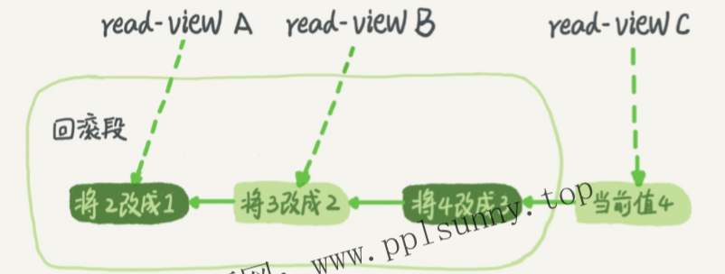

[TOC]


#  何为事务

事务就是要保证一组数据库操作，要么全部成功，要么全部失败。

事务支持是在引擎层实现的。InnoDB支持事务，MyISAM引擎就不支持事务。

#  ACID：事务四个基本特性

提到事务，你肯定会想到**ACID（Atomicity、Consistency、Isolation、Durability，即原子性、一致性、隔离性、持久性）**

◆原子性（Atomicity）：一个事务中所有操作全部完成或失败

◆一致性（Consistency）：事务开始和结束之后数据完整性没有被破坏

◆隔离性（lsolation）：允许多个事务同时对数据库修改和读写

◆持久性（Durability）：事务结束之后，修改是永久的不会丢失


#  事务的并发控制(多个事务同时执行)可能产生哪些问题

◆幻读（phantom read）：一个事务第二次查出现第一次没有的结果

◆非重复读（nonrepeatable read）：一个事务重复读两次得到不同结果

◆脏读（dirty read）：一个事务读取到另一个事务没有提交的修改

◆丢失修改（lost update）：并发写入造成其中一些修改丢失

**为了解决这些问题，就有了“隔离级别”的概念**


#  四种事务隔离级别

在谈隔离级别之前，你首先要知道，你隔离得越严实，效率就会越低。

**SQL标准的事务隔离级别包括：读未提交（read uncommitted）、读提交（read committed）、可重复读（repeatable read）和串行化（serializable）。**同时，用视图 或 锁的方式实现这四种隔离级别。

◆**读未提交**是指，一个事务还没提交时，它做的变更就能被别的事务看到。 

​		实现方法：“读未提交”隔离级别下直接返回记录上的最新值，没有视图概念；


◆ **读提交**是指，一个事务提交之后，它做的变更才会被其他事务看到。

​		实现方法：在“读提交”隔离级别下，在每个SQL语句开始执行的时候创建一个视图，整个事务存在期间都用这个视图。


◆ **可重复读**是指，一个事务执行过程中看到的数据，总是跟这个事务在启动时看到的数据是一致的。当然在可重复读隔离级别下，未提交变更对其他事务也是不可见的。**InnoDB默认实现方式**

​		在“可重复读”隔离级别下，在事务启动时创建一个视图，整个事务存在期间都用这个视图。


◆ **串行化**，顾名思义是对于同一行记录，“写”会加“写锁”，“读”会加“读锁”。当出现读写锁冲突的时候，后访问的事务必须等前一个事务执行完成，才能继续执行。

​		“串行化”隔离级别下直接用加锁的方式来避免并行访问。


我用一个例子说明这几种隔离级别。

假设数据表T中只有一列，其中一行的值为1，下面有两个事务


我们来看看在不同的隔离级别下，图里面V1、V2、V3的返回值分别是什么。

1. 若隔离级别是“读未提交”，则V1的值就是2。这时候事务B虽然还没有提交，但是结果已经被A看到了。因此，V2、V3也都是2。
2. 若隔离级别是“读提交”，则V1是1，V2的值是2。事务B的更新在提交后才能被A看到。所以，V3的值也是2。
3. 若隔离级别是“可重复读”，则V1、V2是1，V3是2。之所以V2还是1，遵循的就是这个要求：事务在执行期间看到的数据前后必须是一致的。
4. 若隔离级别是“串行化”，则在事务B执行“将1改成2”的时候，会被锁住。直到事务A提交后，事务B才可以继续执行。所以从A的角度看，V1、V2值是1，V3的值是2。


#  回滚日志------数据库的多版本并发控制（MVCC）

在MySQL中，实际上每条记录在更新的时候都会同时记录一条回滚操作。记录上的最新值，通过回滚操作，都可以得到前一个状态的值。

假设一个值从1被按顺序改成了2、3、4，在回滚日志里面就会有类似下面的记录。



当前值是4，但是在查询这条记录的时候，不同时刻启动的事务会有不同的视图read-view。

如图中看到的，在视图A、B、C里面，他们记录的值分别是1、2、4。因此同一条记录在系统中可以存在多个版本，就是**数据库的多版本并发控制（MVCC）**。对于read-view A，要得到1，就必须将当前值依次执行图中所有的回滚操作得到。
同时你会发现，即使现在有另外一个事务正在将4改成5，这个事务跟read-viewA、B、C对应的事务是不会冲突的。

#####  回滚日志不能一直保留，什么时候删除呢？

答案是，在不需要的时候才删除。
也就是说，系统会判断，当没有事务再需要用到这些回滚日志时，回滚日志会被删除。
什么时候才不需要了呢？就是当系统里没有比这个回滚日志更早的read-view的时候。

#####  为何不建议使用长事务

长事务意味着系统里面会存在很老的事务视图。由于这些事务随时可能访问数据库里面的任何数据，所以这个事务提交之前，数据库里面它可能用到的回滚记录都必须保留，这就会导致大量占用存储空间。


#  如何使用 事务？------ sql里面 和 python Django orm里面

######  sql

MySQL的事务启动方式有以下几种：
1.显式启动事务语句，begin或start transaction。配套的提交语句是commit，回滚语句是rollback。
2.set autocommit=0，这个命令会将这个线程的自动提交关掉。意味着如果你只执行一个select语句，这个事务就启动了，而且并不会自动提交。这个事务持续存在直到你主动执行commt或rolback语句，或者断开连接。

有些客户端连接框架会默认连接成功后先执行一个set autocommit=0的命令。这就导致接下来的查询都在事务中，如果是长连接，就导致了意外的长事务。
因此，我会建议你总是使用set autocommit=1，通过显式语句的方式来启动事务。

3.但是有的开发同学会纠结“多一次交互”的问题。对于一个需要频繁使用事务的业务，第二种方式每个事务在开始时都不需要主动执行一次“begin”，减少了语句的交互次数。如果你也有这个顾虑，我建议你使用commit work and chain语法。
在autocommit为1的情况下，用begin显式启动的事务，如果执行commt则提交事务。如果执行commit work and chain，则是提交事务并自动启动下一个事务，这样也省去了再次执行begin语句的开销。同时带来的好处是从程序开发的角度明确地知道每个语句是否处于事务中。

######  Django orm

```python
# Transaction 示例
session.begin（）
try:
    iteml=session.query（Item）.get（1）
    item2=session.query（Item）.get（2）
    iteml.foo='bar'
    item2，bar='foo'
    session.commit（）
except:
    session.rollback（）
    raise
```


#  锁------全局锁、表级锁和行锁

数据库锁设计的初衷便是处理并发问题。

根据加锁的范围，MySQL里面的锁大致可以分成全局锁、表级锁和行锁三类。

##### 全局锁 （锁库）------FTWRL命令

**概念**：

​	全局锁就是**对整个数据库**实例加锁。

​	MySQL提供了一个加全局读锁的方法，命令是Flush tables with read lock（FTWRL）。当你需要让整个库处于只读状态的时候，可以使用这个命令，之后其他线程的**以下语句会被阻塞：数据更新语句（数据的增删改）、数据定义语句（包括建表、修改表结构、增加字段等等）和更新类事务的提交语句**。也就是说，**使用FTWRL命令后，整个库处于只读状态**。

**典型使用场景：**做全库逻辑备份。也就是把整库每个表都select出来存成文本。

在整个数据库备份的时候，如果不加锁的话，备份系统备份的得到的库不是一个逻辑时间点，这个视图是逻辑不一致的。


#####  mysqldump工具（可重复读隔离方式），readonly方式，FTWRL命令(全局锁) 三种区别

上面讲到，当整个数据库备份的时候，为了保证备份的数据库完整，需要让整个数据库处于只读状态。而这里有三种方法可以实现 整个数据库处于只读状态：**mysqldump工具（可重复读隔离方式），readonly方式，FTWRL命令(全局锁) **。 

我们来比较他们的不同：

**mysqldump工具（可重复读隔离方式）**

在上面mysql事务的四种级别的隔离方式中，可重复读隔离是InnoDB默认的方式，同时这种隔离方式可以得到一致性视图，因此如果用可重复读隔离级别的事务实现整个数据库的备份，也不会造成冲突。


官方自带的逻辑备份工具是**mysqldump**。当mysqldump使用参数**-single-transaction**的时候，导数据之前就会启动一个可重复读隔离级别的事务，来确保拿到一致性视图。而由于MVCC的支持，**这个过程中数据是可以正常更新的（优势）**。

但是MylSAM引擎不支持事务引擎，InnoDB才支持。

所以，single-transaction方法只适用于所有的表使用事务引擎的库。如果有的表使用了不支持事务的引擎，那么备份就县能通过FTWL方法。

**readonly方式**

使用set global readonly=true的方式也可以让全库进入只读状态，但我还是会建议你用FTWRL方式，主要原因是：在异常处理机制上有差异。

如果执行FTWRL命令之后由于客户端发生异常断开，那么MySQL会自动释放这个全局锁，整个库回到可以正常更新的状态。而将整个库设置为readonly之后，如果客户端发生异常，则数据库就会一直保持readonly状态，这样会导致整个库长时间处于不可写状态，风险较高。

#####  表级锁（锁表）

MySQL里面表级别的锁有两种：一种是**表锁**，一种是**元数据锁（meta data lock，MDL）**。

表锁是我们人工加上的，MDL是自动加上的

**表锁**

表锁的语法是lock tables..read/write。

与FTWRL类似，可以用unlock tables主动释放锁，也可以在客户端断开的时候自动释放。需要注意，lock tables语法**除了会限制别的线程的读写外，也限定了本线程接下来的操作对象**。

比如

```mysql
lock tables t1 read,t2 write;
#这个语句，则其他线程写t1、读写t2的语句都会被阻塞。同时，线程A在执行unlock tables之前，也只能执行读t1、读写t2的操作。连写t1都不允许，自然也不能访问其他表。
```

**MDL（metadata lock）**

另一类表级的锁是MDL（metadata lock）。

MDL**不需要显式使用**，在访问一个表的时候会被自动加上。

因此，在MySQL5.5版本中引入了MDL，当对一个表做增删改森爆作的的候，加MDL读锁；当要对表做结构变更操作的时候，加MDL写锁。
	1.读锁之间不互斥，因此你可以有多个线程同时对一张表增删改查。
	2.读写锁之间、写锁之间是互斥的，用来保证变更表结构操作的安全性。因此，如果有两个线程要同时给一个表加字段，其中一个要等另一个执行完才能开始执行。

事务中的MDL锁，在语句执行开始时申请，但是语句结束后并不会马上释放，而会等到整个事务提交后再释放。

**MDL可能会导致的问题**：

事务中的MDL锁，在语句执行开始时申请，但是语句结束后并不会马上释放，而会等到整个事务提交后再释放。这就会导致严重的阻塞问题。


假设有4条sql语句（这4条语句在一个事务里），A读表，B读表，C写表，D读表，4个sql语句执行顺序为A B C D 

首先A读表，申请了读锁，由于读锁不互斥，所以B也可以读表。

但是读写锁互斥，所以C不能写表，阻塞了。

由于C阻塞了，所以哪怕D是读表语句 也只能等到C执行 自己才能执行，所以也只能阻塞。同理，后面所有的sql语句都会阻塞。

**解决方法：**

1. 解决长事务，事务不提交，就会一直占着MDL锁。

   比如，kill掉长事务。

2. 处理会改变表结构或者表值得语句（上面得语句C）。

   比如 当前这个表的读请求很多，那就可以先放弃语句C，以后再执行语句C。


#####  行锁

1.顾名思义，行锁就是针对数据表中行记录的锁。

​	比如事务A更新了一行，而这时候事务B也要更新同一行，则B会阻塞，必须等事务A的操作完成后才能进行更新。

2.在lnnoDB事务中，行锁是在需要的时候才加上的，但并不是不需要了就立刻释放，而是要等到事务结束时才释放。这个就是两阶段锁协议。

3.如果你的事务中需要锁多个行，要把最可能造成锁冲突、最可能影响并发度的锁尽量往后放。


MySQL的行锁是在引擎层由各个引擎自己实现的。但并不是所有的引擎都支持行锁，比如MyISAM引擎就不支持行锁。不支持行锁意味着并发控制只能使用表锁，对于这种引擎的表，同一张表上任何时刻只能有一个更新在执行，这就会影响到业务并发度。InnoDB是支持行锁的，这也是MyISA被InnoDB替代的重要原因之一。

# 死锁和死锁检测

当并发系统中不同线程出现循环资源依赖，涉及的线程都在等待特别的线程释放资源时，就会导致这几个线程都进入无限等待的状态，称为**死锁**。

#####  解决死锁方法

当出现死锁以后，有两种策略：

1. 一种策略是，直接进入等待，直到超时。这个超时时间可以通过参数innodb_lock_wait_timeout来设置。
2. 另一种策略是，发起**死锁检测**，发现死锁后，主动回滚死锁链条中的某一个事务，让其他事务得以继续执行。将参数innodb_deadlock_detect设置为on，表示开启这个逻辑。


两种策略的优缺点：

第一种方法中，innodb_lock_wait_timeout不知道如何设置。值太大，那么在高并发场景下就无法忍受；值太小，那么可能会把有些耗时的正常事务当成死锁。

第二种方法中，

​	死锁检测的方法是 当发现一个事务被锁了（即这个事务需要的资源不能请求），就要检测自己的线程有没有被他人锁住，这样就把cpu浪费在了检测上。


不过，一般情况下，还是用第二种方法：死锁检测。因为当我们在服务端使用中间件，消息队列等 可以减少服务器端并发线程个数，则死锁检测时减少了循环遍历的线程数。