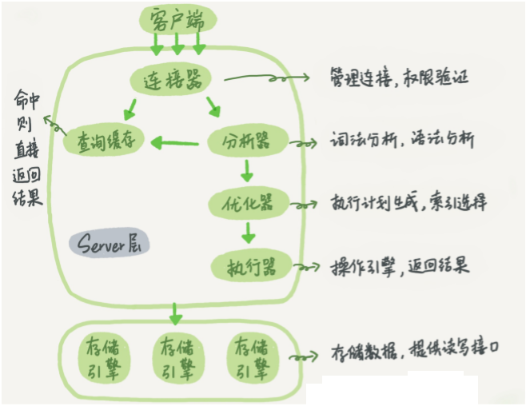
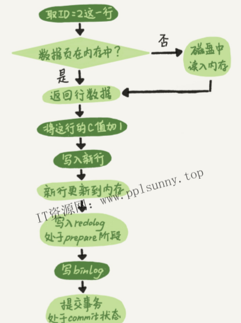

[TOC]

# mysql 基础架构  



MySQL可以分为**Server层**和**存储引擎层**两部分。

#####  Server层

​	包括**连接器、查询缓存、分析器、优化器、执行器**等，

​	涵盖MySQL的大多数核心服务功能，以及所有的内置函数（如日期、时间、数学和加密函数等），所有跨存储引擎的功能都在这一层实现，比如存储过程、触发器、视图等。

**连接器**

连接器负责跟客户端建立连接、获取权限、维持和管理连接。

连接命令中的mysql是客户端工具，用来跟服务端建立连接。在完成经典的TCP握手后，连接器就要开始认证你的身份，这个时候用的就是你输入的用户名和密码。
	如果用户名或密码不对，你就会收到一个"Access denied for user”的错误，然后客户端程序结束执行。
	如果用户名密码认证通过，连接器会到权限表里面查出你拥有的权限。之后，这个连接里面的权限判断逻辑，都将依赖于此时读到的权限。
**这就意味着，一个用户成功建立连接后，即使你用管理员账号对这个用户叔限做了修改，也不会影响已经存在连接的权限。修改完成后，只有再新建的连d使用新的权限设置。**

######  长连接 与 短连接，--- 尽量使用长连接

**长连接**：是指连接成功后，如果客户端持续有请求，则一直使用同一个连接。

**短连接**是指每次执行完很少的几次查询就断开连接，下次查询再重新建立一个。

**建议：尽量使用长连接**，因为建立连接的过程通常是很复杂的。

**长连接缺点：**MySQL在执行过程中临时使用的内存是管理在连接对象里面的。如果长时间不释放长连接，MySQL占用内存涨得特别快。

因此，解决方法是：

1.定期断开长连接。使用一段时间，或者程序里面判断执行过一个占用内存的大查询后，断开连接，之后要查询再重连。
2.如果你用的是MySQL5.7或更新版本，可以在每次执行一个比较大的操作后，通过执行mysql_reset_connection来重新初始化连接资源。这个过程不需要重连和重新做权限验证，但是会将连接恢复到刚刚创建完时的状态。


**查询缓存**

MySQL首次执行一个查询请求，执行完成后，执行结果会以key-value对的形式存入查询缓存中（缓存再内存中）。key是查询的语句，value是查询的结果。

###### 大多数情况下建议不要使用查询缓存

查询缓存的失效非常频繁，只要有对一个表的更新，这个表上所有的查询缓存都会被清空。因此很可能你费劲地把结果存起来，还没使用呢，就被一个更新全清空了。对于更新压力大的数据库来说，查询缓存的命中率会非常低。除非你的业务就是有一张静态表，很长时间才会更新一次。
比如，一个系统配置表，那这张表上的查询才适合使用查询缓存。

```mysql

# 默认的SQL语句都不使用查询缓存
将参数query_cache_type设置成DEMAND，
#对于你确定要使用查询缓存的语句
mysq1>select SQL_CACHE * from T where ID=10;
#要注意的是，MySQL8.0版本直接将查询缓存的整块功能删掉了，也就是说8.0开始彻底没有这个功能了。
```

**分析器**

sql语句语法分析

**优化器**

在开始执行之前，还要先经过优化器的处理。

有的时候，一条sql语句有多种执行方案，优化器要选择效率高的那个。

优化器是在表里面有多个索引的时候，决定使用哪个索引；或者在一个语句有多表关联（join）的时候，决定各个表的连接顺序；等等。

**执行器**

经过优化器后，就可以进入执行器进行执行了。

开始执行的时候，要先判断一下你对这个表T有没有执行查询的权限，如果没有，就会返回没有权限的错误。

如果有权限，就打开表，并调用引擎接口，从第一行数据开始，取出并比较，如果不满足条件则取出第二行数据并比较，依次下去。


比如 select * from T where ID=10; 这个例子中的表T中，ID字段没有索引，那么执行器的执行流程是这样的：
	1.调用InnoDB引攀接口取这个表的第一行，判断ID值是不是10，如果不是则跳过，如果是则将这行存在结果集中；
	2.调用引擎接口取“下一行”，重复相同的判断逻辑，直到取到这个表的最后一行。
	3.执行器将上述遍历过程中所有满足条件的行组成的记录集作为结果集返回给客户端。
至此，这个语句就执行完成了。


##### 存储引擎层

​	负责数据的存储和提取。

​	其架构模式是插件式的，支持InnoDB、MMSAM、Memory等多个存储引擎。现在最常用的存储引擎是InnoDB，它从MySQL5.5.5版本开始成为了默认存储引擎。


不同的存储引擎共用一个Server层

你执行create table建表的时候，如果不指定引擎类型，默认使用的就是InnoDB。不过，你也可以通过指定存储引擎的类型来选择别的引擎，比如在create table语句中使用engine=memory，来指定使用内存引擎创建表。不同存储引擎的表数据存取方式不同，支持的功能也不同，在后面的文章中，我们会讨论到引擎的选择。


# redo log（重做日志）和binlog（归档日志） 

##### redo log 与 binlog 的不同？

这两种日志有以下三点不同。
1.redo log是InnoDB引擎特有的；binlog是MySQL的Server层实现的，所有引擎都可以使用。
2.redo log是物理日志，记录的是“在某个数据页上做了什么修改”；binlog是逻辑日志，记录的是这个语句的原始逻辑，比如“给ID=2这一行的C字段加1”。
3.redo log是循环写的，空间固定会用完；binlog是可以追加写入的。“追加写”是指binlog文件写到一定大小后会切换到下一个，并不会覆盖以前的日志。


##### 为什么会有这两份日志？

因为最开始MySQL里并没有lnnoDB引擎。MySQL自带的引擎是MyISAM，但是MyMSAM没有crash-safe的能力，binlog日志只能用于归档。而InnoDB是另一个公司以插件形式引入MySQL的，既然只依靠binlog是没有crash-safe能力的，所以InnoDB使用另外一套日志系统-一也就是redo log来实现crash-safe能力。


#####  mysql如何解决 更新数据 与 写入磁盘 两个操作之间的效率冲突 ----- WAL技术  redo log 重做日志 

如果每一次的更新操作都需要写进磁盘，然后磁盘也要找到对应的那条记录，然后再更新，整个过程IO成本、查找成本都很高。

为了解决这个问题，使用WAL技术，WAL的全称是Write Ahead Logging。**它的关键点就是先写日志，再写磁盘**。  这里的日志就是 redo log 重做日志


具体来说，当有一条记录需要更新的时候，InnoDB引擎就会先把记录写到 redo log 里面，并更新内存，这个时候更新就算完成了。

InnoDB引擎会在适当的时候（往往是在系统比较空闲的时候），将这个操作记录更新到磁盘里面

当然，InnoDB的redo log是固定大小的，    当redo log写满时，InnoDB引擎会将redo log 前面一部分先写入磁盘，就像一个循环队列一样。

 

#####  crash-safe  当数据库异常重启时 如何保证记录不丢失 ----- redo log 重做日志

redolog是InnoDB引擎特有的日志

有了redo log，InnoDB就可以保证即使数据库发生异常重启，之前提交的记录都不会丢失，这个能力称为crash-safe。

因为 数据更新完成后，数据是写在内存中的，同时redo log中也会有这条日志记录


#####  怎样让数据库恢复到半个月内任意一秒的状态？----- binlog 归档日志

redolog是InnoDB引擎特有的日志，而Server层也有自己的日志，称为binlog（归档日志）

前面我们说过了，binlog会记录所有的逻辑操作，并且是采用“追加写”的形式。如果你的DBA承诺说半个月内可以恢复，那么备份系统中一定会保存最近半个月的所有binlog，同时系统会定期做整库备份。这里的“定期”取决于系统的重要性，可以是一天一备，也可以是一周一备。当需要恢复到指定的某一秒时，比如某天下午两点发现中午十二点有一次误删表，需要找回数据，那你可以这么做：
·首先，找到最近的一次全量备份，如果你运气好，可能就是昨天晚上的一个备份，从这个备份恢复到临时库；
·然后，从备份的时间点开始，将备份的binlog依次取出来，重放到中午误删表之前的那个时刻。
这样你的临时库就跟误删之前的线上库一样了，然后你可以把表数据从临时库取出来，按需要恢复到线上库去。


#####  执行器和InnoDB引擎在执行一条简单的update语句时的内部流程 ----- 执行一条更新语句，redo log 与 binlog 工作任务分配

图中浅色框表示是在InnoDB内部执行的，深色框表示是在执行器中执行的。




1.执行器先找引擎取ID=2这一行。ID是主键，引擎直接用树搜索找到这一行。如果ID=2这一行所在的数据页本来就在内存中，就直接返回给执行器；否则，需要先从磁盘读入内存，然后再返回。
2.执行器拿到引擎给的行数据，把这个值加上1，比如原来是N，现在就是N+1，得到新的一行数据，再调用引擎接口写入这行新数据。
3.引擎将这行新数据更新到内存虫，同时将这个更新操作记录到redo log里面，此时redo log处于prepare状态。然后告诉执行器执行完成了，随时准备提交事务。
4.执行器生成这个操作的binlog，并把binlog写入磁盘。
5.执行器调用引擎的提交事务接口，引擎把刚刚写入的redo log改成提交（commit）状态，更新完成。

#####  为何redolog有两个阶段------ prepare阶段和commit阶段

为了保证 redolog 和 binlog 日志的一致性。


