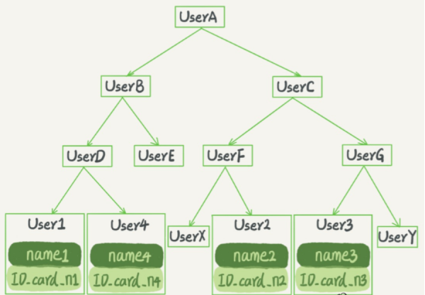

[TOC]

#  查询结构的进化史

线性查找：一个个找；实现简单；太慢
二分查找：有序；简单；要求是有序的，插入特别慢HASH：查询快；占用空间；不太适合存储大规模数据

二叉查找树：插入和查询很快（log（n））；无法存大规模数据，复杂度退化
平衡树：解决bst退化的问题，树是平衡的；节点非常多的时候，依然树高很高
多路查找树：一个父亲多个孩子节点（度）；节点过多树高不会特别深
多路平衡查找树-B-Tree


#  何为索引


为什么需要索引？
◆索引是数据表中一个或者多个列进行排序的数据结构
◆索引能够大幅提升检索速度（回顾上面所讲解的关于查找的数据结构）
◆创建、更新索引本身也会耗费空间和时间

数据库中，使用select * from A where id = 3, 其实是将二维表进行线性查找，这样时间复杂度为O(N)，要是 数据表有几十万条数据，就得好久。

方法就是对数据表的某些字段建立索引。同时 根据不同的查找结构，实现索引的方式也会不同。

下面看根据不同的查询方法，得到不不同索引模型。


#  索引模型

索引的常见模型 哈希表、有序数组 和 搜索树 。

#####  哈希索引

**使用的数据结构: **哈希表

**使用的算法：**哈希函数

**哈希索引使用范围：**

​	哈希表这种结构适用于只有**等值查询**的场景，比如Memcached及其他一些NoSQL引擎(比如 redis 就全是哈希)。

**思路**：

哈希表是一种以键-值（key-value）存储数据的结构，我们只要输入待查找的值即key，就可以找到其对应的值即Value。

哈希的思路很简单，把值放在数组里，用一个哈希函数把key换算成一个确定的位置，然后把value放在数组的这个位置。不可避免地，多个key值经过哈希函数的换算，会出现同一个值的情况。处理这种情况的一种方法是，拉出一个链表。

**例子**:

假设，你现在维护着一个身份证信息和姓名的表，需要根据身份证号查找对应的名字，这时对应的哈希索引的示意图如下所示：


#####  有序数组实现索引

**使用的数据结构: **有序数组

**使用的算法：**二分查找,这个时间复杂度是O(lg(N))

**使用范围：** 

​	在 **等值查询** 和 **范围查询** 场景中的性能就都非常优秀。

​	有序数组索引只适用于**静态存储引擎**，即不会经常进行增加/删除数据的数据表,比如你要保存的是2017年某个城市的所有人口信息，这类不会再修改的数据。

**缺点**： 在需要更新数据的时候就麻烦了，你往中间插入一个记录就必须得挪动后面所有的记录，成本太高。

**例子**:


##### 树形索引

**二叉搜索树**



特点是，每个节点的左儿子小于父节点，父节点又小于右儿子

查找的时间复杂度为 O(lg(N))

为了防止特殊的树形结构，即维持查找的时间复杂度一直为O(lg(N))，就必须保持这棵树是平衡二叉树，因此更新时间复杂度也是O(lg(N))

树可以是二叉，也可以是多叉，下面引入多路平衡查找树。


**多路平衡查找树(B tree)**

为何用多叉树，不用二叉树？

为了适配磁盘的访问模式。

因为索引不止存储再内存中，还要写到磁盘上。

树中一个结点存储到磁盘中的一个数据块中。

当树的结点数相同时，二叉树的树高就会大于多叉树，那么一次查询中，二叉树需要访问的结点树就大于 多叉树，即一次查询中，二叉树访问磁盘的数据块个数大于多叉树。

比如100万结点的平衡二叉树，树高20，一次查询可能就需要访问20个数据块。

而在机械硬盘时代，访问磁盘的数据块，需要寻址，那么访问的数据块越多，寻址次数越多，消耗的时间越多。


**B+ tree**

在MySQL中，索引是在存储引擎层实现的的，所以并没有统一的索引标准，即不同存储引擎的索引的工作方式并不一样。而即使多个存储引擎支持同一种类型的索引，其底层的实现也可能不同。由于InnoDB存储引擎在MySQL数据库中使用最为广泛，所以下面我就以InnoDB为例，和你分析一下其中的索引模型。

InnoDB使用的是B+ tree数据结构。

B+ tree 是B tree 的变形。


#  InnoDB中的索引模型

在MySQL中，索引是在存储引擎层实现的的，所以并没有统一的索引标准，即不同存储引擎的索引的工作方式并不一样。而即使多个存储引擎支持同一种类型的索引，其底层的实现也可能不同。由于InnoDB存储引擎在MySQL数据库中使用最为广泛，所以下面我就以InnoDB为例，和你分析一下其中的索引模型。

#####  sql语句创建索引

假设，我们有一个主键列为ID的表，表中有字段k，并且在k上有索引。
这个表的建表语句是：

```sql
mysq1>create table T(
		 id int primary key, 
         k int not null, 
         name varchar(16), 
         index(k))engine=InnoDB;
```


#####  InnoDB中表的存储方式

在lnnoDB中，表都是根据主键顺序以索引的形式存放的，这种存储方式的表称为索引组织表。又因为前面我们提到的，InnoDB使用了B+树索引模型，所以数据都是存储在B+树中的。
每一个索引在InnoDB里面对应一棵B+树。


#  索引分类

#####  主键索引和非主键索引

从上图中不难看出，根据叶子节点的内容，索引类型分为**主键索引**和**非主键索引**。
**主键索引**：

​	叶子节点存的是整行数据。在InnoDB里，主键索引也被称为**聚簇索引（clustered index）**。
**非主键索引(普通索引)**

​	叶子节点内容是主键的值。在lnnoDB里，非主键索引也被称为**二级索引（secondaryindex）**。

**主键索引 与 非主键索引(普通索引) 的区别 **：

主键查询方式，则只需要搜索ID这棵B+树；

普通索引查询方式，则需要先搜索k索引树，得到ID的值为500，再到ID索引树搜索一次。这个过程称为回表。

也就是说，基于非主键索引的查询需要多扫描一棵索引树。因此，我们在应用中应该尽量使用主键查询。


##### 聚集索引 和 非聚集索引

聚集还是非聚集指的是B+Tree叶节点存的是指针还是数据记录

 MyISAM索引和数据分离，使用的是非聚集索引

InnoDB数据文件就是索引文件，主键索引就是聚集索引


#####  索引创建方法

```mysql
# 添加PRIMARY KEY（主键索引）
mysql>ALTER TABLE `table_name` ADD PRIMARY KEY ( `column` ) 
# 添加INDEX(普通索引) 
mysql>ALTER TABLE `table_name` ADD INDEX index_name ( `column` ) 
# 添加UNIQUE(唯一索引) 索引列的值必须唯一
mysql>ALTER TABLE `table_name` ADD UNIQUE ( `column` )
# 添加多列索引  （由多列构成一个索引）
mysql>ALTER TABLE `table_name` ADD INDEX index_name ( `column1`, `column2`, `column3` )
```


#  创建表时，自增主键 与 把业务逻辑字段作为主键

#####  自增主键

一般的，要求建表语句里一定要有自增主键。


自增主键是指自增列上定义的主键，在建表语句中一般是这么定义的：NOT NULL PRIMARY KEY AUTO_INCREMENT。

插入新记录的时候可以不指定ID的值，系统会获取当前ID最大值加1作为下一条记录的ID值。
也就是说，自增主键的插入数据模式，正符合了我们前面提到的递增插入的场景。每次插入一条新记录，都是追加操作，都不涉及到挪动其他记录，也不会触发叶子节点的分裂。


**自增主键的优势：**

**性能上**：

​	自增主键 在 插入新记录的时候可以不指定ID的值，系统会获取当前ID最大值加1作为下一条记录的ID值

​	而有业务逻辑的字段做主键，则往往不容易保证有序插入，这样写数据成本相对较高。

**存储空间上**


​	观察InnoDB的B+ tree 索引，可以发现，每个普通索引的叶子节点上都是主键的值，

​				如果用自增主键，则每个普通索引的叶子节点上存储的主键值都是int型，占4个字节。

​				如果用有业务逻辑的字段作为主键（比如 身份证号码），则每个普通索引的叶子节点上存储的主键值是个字符串，可能要占用20个字节。

显然，主键长度越小，普通索引的叶子节点就越小，普通索引占用的空间也就越小。


#####  业务逻辑的字段做主键

一般的，要求建表语句里一定要有自增主键，但事无绝对，有的时候把 业务逻辑的字段做主键 可能也会不错。

**有没有什么场景适合用业务字段直接做主键的呢？**

​	还是有的。比如，有些业务的场景需求是这样的：
​		1.只有一个索引；
​		2.该索引必须是唯一索引。

由于没有其他索引，所以也就不用考虑其他索引的叶子节点大小的问题。
这时候直接将这个索引设置为主键，相对于自增主键，可以避免每次查询需要搜索两棵树。


# 最左前缀原则 与 模糊匹配

**最左前缀原则**

B+树这种索引结构，可以利用索引的“最左前缀”，来定位记录。

举个例子，我们如果用（name，age）构建联合索引，则B+树的叶子结点大概为


**可以看到，索引项是按照索引定义里面出现的字段顺序排序的。**

当你的逻辑需求是查到所有名字是“张三”的人时，可以快速定位到ID4，然后向后遍历得到所有需要的结果。

**只要满足最左前缀，就可以利用索引来加速检索。这个最左前缀可以是联合索引的最左N个字段，也可以是字符串索引的最左M个字符。**


**模糊匹配**

如果你要查的是所有名字第一个字是“张”的人，你的SQL语句的条件是"where name like张%”。这时，你也能够用上这个索引，查找到第一个符合条件的记录是ID3，然后向后遍历，直到不满足条件为止。


#  索引优化，在建立联合索引的时候，如何安排索引内的字段顺序

1. 第一原则是，如果通过调整顺序，可以少维护一个索引，那么这个顺序往往就是需要优先考虑采用的。

   比如，根据最左前缀原则，当已经有了（a，b）这个联合索引后，一般就不需要单独在a上建立索引了。因为这样的索引的复用能力强。

   

2. 第二原则是，考虑减少空间的占用。

   比如，有a,b的联合查询 where a=1 and b =2,  且有a,b 各自得查询 where a=1 ,  where b=1。 那么是 构建(a,b), b这两个索引，还是构建 (b, a), a这两个索引？

   根据第二原则，应该考虑空间作用少得那种。假设name字段比age字段占用大，则应该建立(name, age)得联合索引 和 (age)得单字段索引。


#  索引优化，如何避免回表过程

##### 何为回表

首先 我们先创建一个数据表

```mysql
mysq1>create table T(
				ID int primary key, 
    			k int NOT NULL DEFAULT,
    			s varchar(16) NOT NULL DEFAULT",
    			indexk(k))engine=InnoDB; 
 
 mysq1> insert into T values(180,1,'aa'),(200,2,'bb'),(300,3,'cc'),(500,5,'ee'),(600,6,'ff'),(700,7,
```

得到的B+ tree表为


当执行 select * from T where k=3;

由于对k建立了一个普通索引，所以mysql会先到 k索引上找到 k=3的叶子节点，该叶子节点对应的值为表的主键（300），然后mysql就又回到主键索引 找到id=300的叶子节点。

这个过程中，从普通索引回到主键索引 树搜索的过程，我们称为 **回表**。


在这个例子中，由于查询结果所需要的数据只在主键索引上有，所以不得不回表。那么，有没有可能经过索引优化，避免回表过程呢？

#####  索引优化，避免回表的方法：覆盖索引, 索引下堆优化

**覆盖索引**

我们之所以会发生回表，原因是想要的查询结果所需要的数据只在主键索引上有，所以不得不回表。因此，要是我们想要的数据就在当前的普通索引下呢？

比如上面的不再是 select * from ... ，而是 select ID from T where k=3; 由于k字段索引的叶子节点就是存储的对应的ID值，直接取出来就可以了，不需要再回表。

也就是说，在这个查询里面，索引k已经“覆盖了”我们的查询需求，我们称为**覆盖索引**。

由于覆盖索引可以减少树的搜索次数，显著提升查询性能，所以**使用覆盖索引是一个常用的性能优化手段**。


覆盖索引另一种常见用法就是-----建立 **联合索引**

比如，现在身份证号字段建立了一个普通索引，如果现在有一个高频请求，要根据市民的身份证号查询他的姓名，我们就可以建立一个（身份证号、姓名）的联合索引。

它可以在这个高频请求上**用到覆盖索引**，不再需要回表查整行记录, 而是直接取出姓名，减少语句的执行时间。

当然，建立联合索引 的缺点就是会浪费空间。


#  索引优化，索引下堆优化

```mysql
mysq1>select * from tuser where name like '张%' and age=10 and ismale=1；
```

你已经知道了最左前缀索引规则，所以这个语句在搜索索引树的时候，只能用“张”，找到第一个满足条件的记录ID3。当然，这还不错，总比全表扫描要好。
然后呢？如何判断另外两个条件是否满足？

用索引下堆优化。

在MySQL5.6之前，只能从ID3开始一个个回表。到主键索引上找出数据行，再对比字段值。
而MySQL5.6引入的索引下推优化（index condition pushdown），可以在索引遍历过程中，对索引中包含的字段先做判断，直接过滤掉不满足条件的记录，减少回表次数。

**索引下堆优化**：在索引遍历过程中，对索引中包含的字段先做判断，直接过滤掉不满足条件的记录，**减少回表次数**

