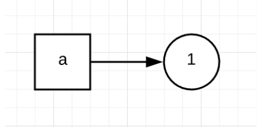
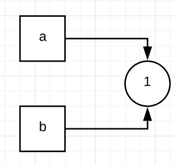
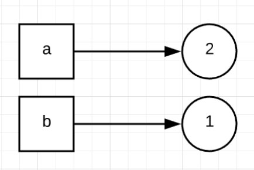
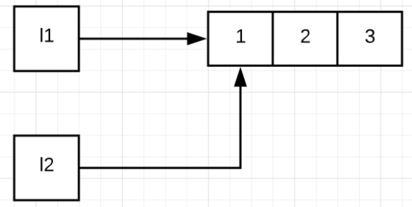
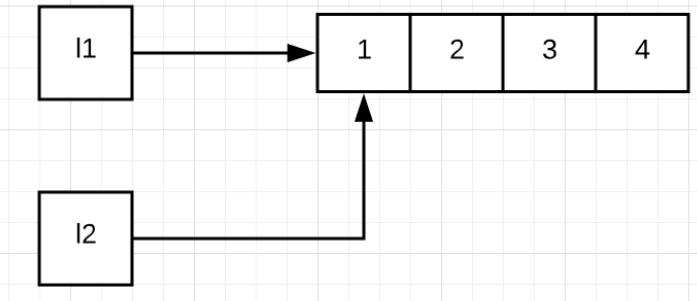

[TOC]


# 装饰器与闭包

**所谓的装饰器，其实就是通过装饰器函数，来修改原函数的一些功能，使得原函数不需要修改。**


**函数**

1. 在 Python 中，函数是一等公民（first-class citizen），函数也是对象，
   1. 即我们可以把函数赋予变量
   2. 我们可以把函数当作参数，传入另一个函数中
   3. 我们可以在函数里定义函数，也就是函数的嵌套。
   4. 函数的返回值也可以是函数对象（即实现 闭包）

**闭包**

```python
def func_closure():

    def get_message(message):

        print('Got a message: {}'.format(message))

    return get_message


send_message = func_closure()
send_message('hello world')
##这里，函数 func_closure() 的返回值是函数对象 get_message 本身，之后，我们将其赋予变量 send_message，再调用 send_message(‘hello world’)，最后输出了'Got a message: hello world'。

# 输出
Got a message: hello world
```


**简单的装饰器**

```python
def my_decorator(func):
    def wrapper():
        print('wrapper of decorator')
        func()
    return wrapper


def greet():
    print('hello world')

 
greet = my_decorator(greet)
greet()

## 这段代码中，变量 greet 指向了内部函数 wrapper()，而内部函数 wrapper() 中又会调用原函数 greet()，因此，最后调用 greet() 时，就会先打印'wrapper of decorator'，然后输出'hello world'
# 输出
wrapper of decorator
hello world

## 这里的函数 my_decorator() 就是一个装饰器，它把真正需要执行的函数 greet() 作为自己的输入，输出依然命名为greet, 此时输出的greet不仅仅会执行自己的代码 print('hello world'), 同时还会执行my_decorator()里的代码print('wrapper of decorator')， 相当于在不改变原函数greet源码的前提下，修改了greet的功能。
```


即

```python
def my_decorator(func):
    def wrapper():
        print('wrapper of decorator')
        func()
    return wrapper

@my_decorator
def greet():
    print('hello world')

greet()

## 这里的@，我们称之为语法糖，@my_decorator就相当于前面的 greet=my_decorator(greet) 语句
```


**装饰器中被修饰的函数带参数**

```python

# 最简单的形式
def my_decorator(func):
    def wrapper(message):
        print('wrapper of decorator')
        func(message)
    return wrapper

# 常用形式
def my_decorator(func):
    def wrapper(*args, **kwargs):
        print('wrapper of decorator')
        func(*args, **kwargs)
    return wrapper

@my_decorator
def greet(message):
    print(message)


greet('hello world')


# 输出
wrapper of decorator
hello world
```


**装饰器中 装饰器自己 要 带参数**

```python
def repeat(num):
    def my_decorator(func):
        def wrapper(*args, **kwargs):
            for i in range(num):
                print('wrapper of decorator')
                func(*args, **kwargs)
                
        return wrapper
    return my_decorator

 
@repeat(4)
def greet(message):
    print(message)


greet('hello world')

 
# 输出：
wrapper of decorator
hello world
wrapper of decorator
hello world
wrapper of decorator
hello world
wrapper of decorator
hello world
```


**类装饰器**

实际上，类也可以作为装饰器。类装饰器主要依赖于函数`__call__()`，每当你调用一个类的示例时，函数`__call__()`就会被执行一次。

```python
class Count:
    def __init__(self, func):
        self.func = func
        self.num_calls = 0

 
    def __call__(self, *args, **kwargs):
        self.num_calls += 1
        print('num of calls is: {}'.format(self.num_calls))
        return self.func(*args, **kwargs)


@Count
def example():
    print("hello world")

 
example()

# 输出
num of calls is: 1
hello world


example()

# 输出
num of calls is: 2
hello world

 


```

**多层装饰器**

```python
@decorator1
@decorator2
@decorator3
def func():
    ...

    
# 上面代码相当于
decorator1(decorator2(decorator3(func)))

    
```

则有：

```python
import functools

 
def my_decorator1(func):
    @functools.wraps(func)
    def wrapper(*args, **kwargs):
        print('execute decorator1')
        func(*args, **kwargs)
    return wrapper

 

def my_decorator2(func):
    @functools.wraps(func)
    def wrapper(*args, **kwargs):
        print('execute decorator2')
        func(*args, **kwargs)
    return wrapper

 
@my_decorator1
@my_decorator2
def greet(message):
    print(message)


greet('hello world')


# 输出
execute decorator1
execute decorator2
hello world
```


#  GIL

#####  何为GIL

CPython 是用c语言实现的一个Python 解释器 ，（当然还有Jpython是用java实现的一个python解释器）

GIL 是 CPython中的一个概念，即 全局解释器锁。


#####  GIL如何工作

GIL使得同一个时刻只有一个线程在一个cpu核上执行字节码。

每一个 Python 线程，在 CPython 解释器中执行时，都会先锁住自己的线程，阻止别的线程执行。当当前线程的时间片用完/ 因为io等原因阻塞时，当前线程退出cpu核，下一个线程才能用上这个cpu核。

所以，GIL使得并发很受限, 无法利用cpu多核的优势。

GIL会根据执行的字节码行数以及时间片释放，在遇到io操作的时候主动释放。

释放后会将当前cpu让给其他python线程执行。由于gil在遇到io操作时会主动释放，则gil在有频繁io处理的场景下很实用。


##### CPython引入GIL概念原因

我们找到，CPython 使用引用计数来管理内存，所有 Python 脚本中创建的实例，都会有一个引用计数，来记录有多少个指针指向它。当引用计数只有 0 时，则会自动释放内存。

如果 不用GIL，那么如果有两个 Python 线程同时引用了 a，就会造成引用计数的 race condition，即本来a的引用数变为2，但是两个变量同时引用a，则a的引用变为1。如果第一个线程结束，会把引用计数减少 1，则a的引用数为0，这时可能达到条件释放内存，当第二个线程再试图访问 a 时，就找不到有效的内存了。


所以说，CPython  引进 GIL 其实主要就是这么两个原因：

- 一是设计者为了规避类似于内存管理这样的复杂的竞争风险问题（race condition）；
- 二是因为 CPython 大量使用 C 语言库，但大部分 C 语言库都不是原生线程安全的（线程安全会降低性能和增加复杂度）。


#####  +=导致的线程不安全问题（有了GIL，线程也不一定安全）

有了 GIL，并不意味着我们 Python 编程者就不用去考虑线程安全了。

比如a+=1, 翻译成字节码其实是4行代码。

那么有两个线程

线程A为 a+=1, 循环100次，

线程B为 a-=1, 循环100次，

那么当这两个线程都执行完后，a==0。但是因为a+=1翻译成字节码其实是4行代码，则结果可能是不可预测的。


# 容器，可迭代对象，迭代器

#####  容器


在 Python 中一切皆对象，对象的抽象就是类，而对象的集合就是容器。

列表（list: [0, 1, 2]），元组（tuple: (0, 1, 2)），字典（dict: {0:0, 1:1, 2:2}），集合（set: set([0, 1, 2])）都是容器。

对于容器，你可以很直观地想象成多个元素在一起的单元

而不同容器之间的区别，正是各自内部数据结构的实现方法。

所有的容器都是可迭代的（iterable）。


#####  迭代器

迭代可以想象成是你去买苹果，卖家并不告诉你他有多少库存。这样，每次你都需要告诉卖家，你要一个苹果，然后卖家采取行为：

​				要么给你拿一个苹果；

​				要么告诉你，苹果已经卖完了。

​		你并不需要知道，卖家在仓库是怎么摆放苹果的。


迭代器（iterator）提供了一个 next 的方法。调用这个方法后，

​				你要么得到这个容器的下一个对象，

​				要么得到一个 StopIteration 的错误（苹果卖完了）。

​		你并不需要知道这个容器是怎么存储你的数据的。你就只需要知道，next 函数可以不重复不遗漏地一个一个拿到所有元素即可。


#####  可迭代对象

而可迭代对象，通过 iter() 函数返回一个迭代器，再通过 next() 函数就可以实现遍历。for in 语句将这个过程隐式化，所以，你只需要知道它大概做了什么就行了

所以，如果你希望你声明的类的实例是一个可迭代的对象，那么只需在类里面实现两个魔法函数 \_\_iter\_\_, \_\_next\_\_


# 生成器

通过 yield得到一个生成器，通过next()调用这个生成器。


[i for i in range(100000000)] 得到一个迭代器

（ i for i in range(100000000) ） 得到一个生成器 （注意，这可不是元组）


`[i for i in range(100000000)]`就可以生成一个包含一亿元素的列表。每个元素在生成后都会保存到内存中，你通过代码可以看到，它们占用了巨量的内存，内存不够的话就会出现 OOM 错误。

不过，我们并不需要在内存中同时保存这么多东西，比如对元素求和，我们只需要知道每个元素在相加的那一刻是多少就行了，用完就可以扔掉了。

于是，生成器的概念应运而生，在你调用 next() 函数的时候，才会生成下一个变量。生成器在 Python 的写法是用小括号括起来，`(i for i in range(100000000))`，即初始化了一个生成器。


迭代器得到一个可迭代对象，且是一次性得到。

生成器并不会像迭代器一样占用大量内存，只有在被使用的时候才会调用。而且生成器在初始化的时候，并不需要运行一次生成操作。相比于 test_iterator() ，test_generator() 函数节省了一次生成一亿个元素的过程，因此耗时明显比迭代器短。


# 多进程编程，多线程编程


#  IO多路复用（select, poll, epoll）

I/O多路复用: 就是通过一种机制，可以监视多个描述符，一旦某个描述符就绪（一般是读就绪或者写就绪），能够通知程序进行相应的读写操作。

I/O多路复用 分为 同步io, 和 异步io

**select，poll，epoll本质上都是同步I/O，因为他们都需要在读写事件就绪后自己负责进行读写，也就是说这个读写过程是阻塞的**

异步I/O则无需自己负责进行读写，异步I/O的实现会负责把数据从内核拷贝到用户空间。

#####  select


# 协程


# 并发编程之Futures


# 并发编程之Asyncio


#  python常见类型的实现方式


#  == vs is

`'=='`操作符比较对象之间的值是否相等

`'is'`操作符比较的是对象的身份标识是否相等，即它们是否是同一个对象，是否指向同一个内存地址，即id()的值


事实上，出于对性能优化的考虑，Python 内部会对 -5 到 256 的整型维持一个数组，起到一个缓存的作用。这样，每次你试图创建一个 -5 到 256 范围内的整型数字时，Python 都会从这个数组中返回相对应的引用，而不是重新开辟一块新的内存空间。

所以 可能存在下面结果

```python
a = 1
b = 1
a is b #结果为True
```


执行`a == b`相当于是去执行`a.__eq__(b)`，而 Python 大部分的数据类型都会去重载`__eq__`这个函数，其内部的处理通常会复杂一些。比如，对于列表，`__eq__`函数会去遍历列表中的元素，比较它们的顺序和值是否相等。


比较操作符`'is'`效率优于`'=='`，因为`'is'`操作符无法被重载，执行`'is'`操作只是简单的获取对象的 ID，并进行比较；而`'=='`操作符则会递归地遍历对象的所有值，并逐一比较。

#  浅拷贝 vs 深拷贝

##### 浅拷贝

是指重新分配一块内存，创建一个新的对象，里面的元素是原对象中子对象的引用。因此，如果原对象中的元素不可变，那倒无所谓；但如果元素可变，浅拷贝通常会带来一些副作用，尤其需要注意。

千万注意：

```python
l1 = [1,2,3]
l2 = l1 #注意，这是赋值，不是浅拷贝，这一句的意思在下面会讲解
l2 = list(l1) #这才是浅拷贝
```


```python
#  l2 就是 l1 的浅拷贝
l1 = [1, 2, 3]
l2 = list(l1)

# s2 是 s1 的浅拷贝
s1 = set([1, 2, 3])
s2 = set(s1)

# 对于可变的序列，我们还可以通过切片操作符':'完成浅拷贝
l1 = [1, 2, 3]
l2 = l1[:]

# Python 中也提供了相对应的函数 copy.copy() 实现浅拷贝，适用于任何数据类型
import copy
l1 = [1, 2, 3]
l2 = copy.copy(l1)
l1 == l2
True

l1 is l2
False

# 注意：对于元组，使用 tuple() 或者切片操作符':'不会创建一份浅拷贝，相反，它会返回一个指向相同元组的引用
t1 = (1, 2, 3)
t2 = tuple(t1)

t1 == t2
True

t1 is t2
True
```

#####  浅拷贝的副作用

```python
# 我们首先初始化了一个列表 l1，里面的元素是一个列表和一个元组；
l1 = [[1, 2], (30, 40)]

# 然后对 l1 执行浅拷贝，赋予 l2。因为浅拷贝里的元素是对原对象元素的引用，因此 l2 中的元素和 l1 指向同一个列表和元组对象。
l2 = list(l1)

# l1.append(100)，表示对 l1 的列表新增元素 100。这个操作不会对 l2 产生任何影响，因为 l2 和 l1 作为整体是两个不同的对象，并不共享内存地址。操作过后 l2 不变，l1 会发生改变：
l1.append(100)

# l1[0].append(3)，这里表示对 l1 中的第一个列表新增元素 3。因为 l2 是 l1 的浅拷贝，l2 中的第一个元素和 l1 中的第一个元素，共同指向同一个列表，因此 l2 中的第一个列表也会相对应的新增元素 3。操作后 l1 和 l2 都会改变
l1[0].append(3)

# 最后是l1[1] += (50, 60)，因为元组是不可变的，这里表示对 l1 中的第二个元组拼接，然后重新创建了一个新元组作为 l1 中的第二个元素，而 l2 中没有引用新元组，因此 l2 并不受影响。操作后 l2 不变，l1 发生改变：
l1[1] += (50, 60)
```


##### 深度拷贝

是指重新分配一块内存，创建一个新的对象，并且将原对象中的元素，以递归的方式，通过创建新的子对象拷贝到新对象中。因此，新对象和原对象没有任何关联。

Python 中以 **copy.deepcopy()** 来实现对象的深度拷贝。


#  值传递 引用传递 ，python变量及其赋值原理

 #####  python既不是值传递，也不是引用传递

在 C/C++ 语言中的特点 中：

所谓值传递，通常就是拷贝参数的值，然后传递给函数里的新变量。这样，原变量和新变量之间互相独立，互不影响。

所谓引用传递，通常是指把参数的引用传给新的变量，这样，原变量和新变量就会指向同一块内存地址。如果改变了其中任何一个变量的值，那么另外一个变量也会相应地随之改变。


Python 中参数的传递既不是值传递，也不是引用传递，而是赋值传递，或者是叫对象的引用传递。这里的赋值或对象的引用传递，不是指向一个具体的内存地址，而是指向一个具体的对象。

#####  python变量及其赋值原理

先说结论，再我下面一步一步看:

由此可见，在 Python 中：

- 变量的赋值，只是表示让变量指向了某个对象，并不表示拷贝对象给变量；而一个对象，可以被多个变量所指向。
- 可变对象（列表，字典，集合等等）的改变，会影响所有指向该对象的变量。
- 对于不可变对象（字符串，整型，元祖等等），所有指向该对象的变量的值总是一样的，也不会改变。但是通过某些操作（+= 等等）更新不可变对象的值时，会返回一个新的对象。
- 变量可以被删除，但是对象无法被删除。

**变量赋值**


```python
a = 1 # 首先将 1 赋值于 a，即 a 指向了 1 这个对象
```





````python
b = a  #b = a 则表示，让变量 b 也同时指向 1 这个对象。这里要注意，Python 里的对象可以被多个变量所指向或引用。
````



综上可知，这里的 a 和 b，开始只是两个指向同一个对象的变量而已，或者你也可以把它们想象成同一个对象的两个名字。简单的赋值 b = a，并不表示重新创建了新对象，只是让同一个对象被多个变量指向或引用。


**不可变对象的值发生改变**

接着上面代码

```python
a = a + 1
"""
执行 a = a + 1。需要注意的是，Python 的数据类型，例如整型（int）、字符串（string）等等，是不可变的。所以，a = a + 1，并不是让 a 的值增加 1，而是表示重新创建了一个新的值为 2 的对象，并让 a 指向它。但是 b 仍然不变，仍然指向 1 这个对象。
因此，最后的结果是，a 的值变成了 2，而 b 的值不变仍然是 1。
"""
```



综上可知，a,b 指向同一个对象，也并不意味着两个变量就被绑定到了一起。如果你给其中一个变量重新赋值，并不会影响其他变量的值。

**可变对象的值发生改变**

```python
l1 = [1, 2, 3]
l2 = l1
# 首先让列表 l1 和 l2 同时指向了 [1, 2, 3] 这个对象
```



```python
l1.append(4)

l1
[1, 2, 3, 4]

l2
[1, 2, 3, 4]

"""
由于列表是可变的，所以 l1.append(4) 不会创建新的列表，只是在原列表的末尾插入了元素 4，变成 [1, 2, 3, 4]。由于 l1 和 l2 同时指向这个列表，所以列表的变化会同时反映在 l1 和 l2 这两个变量上，那么，l1 和 l2 的值就同时变为了 [1, 2, 3, 4]。
"""
```



**变量删除**

Python 里的变量可以被删除，但是对象无法被删除。

```python

l = [1, 2, 3]
del l
# del l 删除了 l 这个变量，从此以后你无法访问 l，但是对象 [1, 2, 3] 仍然存在。Python 程序运行时，其自带的垃圾回收系统会跟踪每个对象的引用。如果 [1, 2, 3] 除了 l 外，还在其他地方被引用，那就不会被回收，反之则会被回收。
```


##### python函数的参数传递

准确地说，Python中并不存在值传递或是引用传递一说

python的参数传递是**赋值传递** （pass by assignment），或者叫作对象的**引用传递**（pass by object reference）。Python 里所有的数据类型都是对象，所以参数传递时，只是让新变量与原变量指向相同的对象而已。

需要注意的是，这里的赋值或对象的引用传递，不是指向一个具体的内存地址，而是指向一个具体的对象。

- 如果对象是可变的，当其改变时，所有指向这个对象的变量都会改变。
- 如果对象不可变，简单的赋值只能改变其中一个变量的值，其余变量则不受影响。

如果你想通过一个函数来改变某个变量的值，通常有两种方法。

​	第一种是直接将可变数据类型（比如列表，字典，集合）当作参数传入，直接在其上修改；

​	第二种则是创建一个新变量，来保存修改后的值，然后将其返回给原变量。

在实际工作中，我们更倾向于使用后者，因为其表达清晰明了，不易出错。


**当函数参数为不可变对象**

```python
def my_func1(b):
	b = 2

a = 1
my_func1(a)
a
# 输出：1

"""
这里的参数传递，使变量 a 和 b 同时指向了 1 这个对象。但当我们执行到 b = 2 时，系统会重新创建一个值为 2 的新对象，并让 b 指向它；而 a 仍然指向 1 这个对象。所以，a 的值不变，仍然为 1。
"""
```


**当函数参数为可变对象**

当可变对象当作参数传入函数里的时候，改变可变对象的值，就会影响所有指向它的变量。

```python

def my_func3(l2):
	l2.append(4)
    
l1 = [1, 2, 3]
my_func3(l1)
l1
# 输出：[1, 2, 3, 4]
"""
这里 l1 和 l2 先是同时指向值为 [1, 2, 3] 的列表。不过，由于列表可变，执行 append() 函数，对其末尾加入新元素 4 时，变量 l1 和 l2 的值也都随之改变了。
"""

```

但是

```python
def my_func4(l2):
	l2 = l2 + [4]

l1 = [1, 2, 3]
my_func4(l1)

l1
# 输出：[1, 2, 3]
"""
为什么 l1 仍然是 [1, 2, 3]，而不是 [1, 2, 3, 4] 呢？
要注意，这里 l2 = l2 + [4]，表示创建了一个“末尾加入元素 4“的新列表，并让 l2 指向这个新的对象。这个过程与 l1 无关，因此 l1的值不变
"""
```

所以一定要注意： 改变变量和重新赋值 二者的区别。

#  python垃圾回收机制

我们反复提过好几次， Python 中一切皆对象。因此，你所看到的一切变量，本质上都是对象的一个指针。

当这个对象的引用计数（指针数）为 0 的时候，说明这个对象永不可达，自然它也就成为了垃圾，需要被回收。

不过，我想还是会有人问，如果我偏偏想手动释放内存，应该怎么做呢？

方法同样很简单。你只需要先调用 del a 来删除一个对象；然后强制调用 gc.collect()，即可手动启动垃圾回收。


如果此时有面试官问：引用次数为 0 是垃圾回收启动的充要条件吗？还有没有其他可能性呢？

先来思考这么一个问题：如果有两个对象，它们互相引用，并且不再被别的对象所引用，那么它们应该被垃圾回收吗？

a 和 b 互相引用，并且，作为局部变量，在函数 func 调用结束后，a 和 b 这两个指针从程序意义上已经不存在了。但是，很明显，依然有内存占用！为什么呢？因为互相引用，导致它们的引用数都不为 0。

当然，有人可能会说，互相引用还是很容易被发现的呀，问题不大。可是，更隐蔽的情况是出现一个引用环，在工程代码比较复杂的情况下，引用环还真不一定能被轻易发现。


事实上，Python 本身能够处理这种情况，我们刚刚讲过的，可以显式调用 gc.collect() ，来启动垃圾回收。


Python 使用标记清除（mark-sweep）算法和分代收集（generational），来启用针对循环引用的自动垃圾回收。

先来看标记清除算法。我们先用图论来理解不可达的概念。对于一个有向图，如果从一个节点出发进行遍历，并标记其经过的所有节点；那么，在遍历结束后，所有没有被标记的节点，我们就称之为不可达节点。显而易见，这些节点的存在是没有任何意义的，自然的，我们就需要对它们进行垃圾回收。

当然，每次都遍历全图，对于 Python 而言是一种巨大的性能浪费。所以，在 Python 的垃圾回收实现中，mark-sweep 使用双向链表维护了一个数据结构，并且只考虑容器类的对象（只有容器类对象才有可能产生循环引用）。具体算法这里我就不再多讲了，毕竟我们的重点是关注应用。


而分代收集算法，则是另一个优化手段。

Python 将所有对象分为三代。刚刚创立的对象是第 0 代；经过一次垃圾回收后，依然存在的对象，便会依次从上一代挪到下一代。而每一代启动自动垃圾回收的阈值，则是可以单独指定的。当垃圾回收器中新增对象减去删除对象达到相应的阈值时，就会对这一代对象启动垃圾回收。

事实上，分代收集基于的思想是，新生的对象更有可能被垃圾回收，而存活更久的对象也有更高的概率继续存活。因此，通过这种做法，可以节约不少计算量，从而提高 Python 的性能。

学了这么多，刚刚面试官的问题，你应该能回答得上来了吧！没错，引用计数是其中最简单的实现，不过切记，引用计数并非充要条件，它只能算作充分非必要条件；至于其他的可能性，我们所讲的循环引用正是其中一种。


 objgraph，一个非常好用的可视化引用关系的包。在这个包中，我主要推荐两个函数，第一个是 show_refs()，它可以生成清晰的引用关系图。

而另一个非常有用的函数，是 show_backrefs()。


最后，带你来总结一下。今天这节课，我们深入了解了 Python 的垃圾回收机制，我主要强调下面这几点：

1. 垃圾回收是 Python 自带的机制，用于自动释放不会再用到的内存空间；
2. 引用计数是其中最简单的实现，不过切记，这只是充分非必要条件，因为循环引用需要通过不可达判定，来确定是否可以回收；
3. Python 的自动回收算法包括标记清除和分代收集，主要针对的是循环引用的垃圾收集；
4. 调试内存泄漏方面， objgraph 是很好的可视化分析工具。


# Python是静态还是动态类型？是强类型还是弱类型？

python是  动态强类型语言（不少人误以为是弱类型）
◆动态还是静态指的是编译期还是运行期确定类型
◆强类型指的是不会发生隐式类型转换


# Python作为后端语言优缺点

为什么要用Python？
◆胶水语言，轮子多，应用广泛
◆语言灵活，生产力高
◆性能问题、代码维护问题、python2/3兼容问题

动态语言一直爽，代码重构火葬场。

#  什么是鸭子类型

“当看到一只鸟走起来像鸭子、游泳起来像鸭子、叫起来也像鸭子，那么这只鸟就可以被称为鸭子。"
·关注点在对象的行为，而不是类型（duck typing）
◆比如file，StringIO，socket 对象都支持read/write方法（file like object）
◆再比如定义了__iter_魔术方法的对象可以用for迭代

鸭子类型更关注接口而不是类型

#  什么是monkey patch猴子补丁

什么是monkey patch？哪些地方用到了？自己如何实现？
◆所谓的monkey patch 就是运行时替换

◆比如gevent 库需要修改内置的socket 

from gevent import monkey；monkey.patch_socket


#  什么是自省？

◆运行时判断一个对象的类型的能力
◆Python一切皆对象，用type，id，isinstance获取对象类型信息
◆Inspect模块提供了更多获取对象信息的函数


#  什么是列表和字典推导

◆比如[i for iin range（10）ifi%2==0]
◆一种快速生成list/dict/set的方式。用来替代map/filter等
◆（i for iin range（10）ifi%2==0）返回生成器

#  知道Python之禅吗

The Zen of Python
◆Tim Peters编写的关于Python编程的准则
◆import this
◆编程拿不准的时候可以参考

#  如何剖析程序性能

使用各种 profile工具（内置或第三方）
◆二八定律，大部分时间耗时在少量代码上
◆内置的profile/cprofile等工具
◆使用pyflame（uber开源）的火焰图工具


#  服务端性能优化措施

Web应用一般语言不会成为瓶颈
◆数据结构与算法优化
◆数据库层：索引优化，慢查询消除，批量操作减少IO，NoSQL
◆网络IO：批量操作，pipeline操作减少IO

◆缓存：使用内存数据库 redis/memcached
◆异步：asyncio，celery

◆并发：gevent/多线程