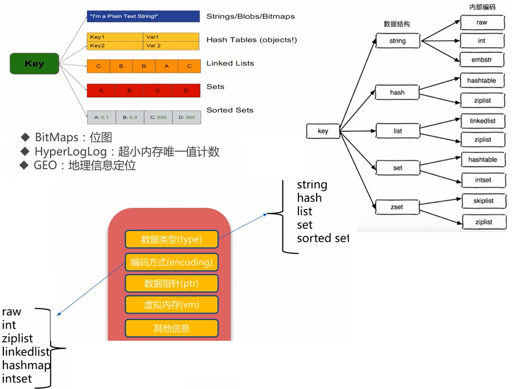

[TOC]

#  redis简介

redis是非关系型数据库，采用键值对key-value 的方式，将数据存储在内存上。

redis **数据存储在内存**，用**c语言编写**，**不依赖外部库**，且为**单线程模型**

由于将数据保存在内存中，为了防止掉电后数据丢失，resid对**数据的更新**将异步地保存到磁盘上。即**reis具有持久性，断电不丢数据**


**redis包含的数据结构**

redis的数据使用都是以键值对key-value形式（则肯定会用到 哈希算法）

redis包含的数据结构有




redis-sentinel(v2.8)支持**高可用**

redis-cluster(v3.0)支持**分布式**


**redis功能丰富**:

 	1.  发布订阅
 	2.  Lua脚本
 	3.  事务
 	4.  pipeline


**redis可以进行 主从复制**


#  redis应用场景


​	

#  redis安装

###  redis下载安装

```powershell

wget http://download.redis.io/releases/redis-3.0.7.tar.gz
tar -xzf redis-3.0.7.tar.gz
ln -s redis-3.0.7 redis
cd redis
make && make install
```

###  redis 可执行命令 详解

```powershell
redis-server #开启Redis服务器
redis-cli #开启Redis命令行客户端
redis-benchmark #Redis性能测试工具
redis-check-aof #AOF文件修复工具
redis-check-dump #RDB文件检查工具
redis-sentinel #sentinel服务器（2.8以后）
```

###  redis服务器端的启动方式

验证是否启动

```powershell
ps -ef | grep redis
netstat -antpl | grep redis
redis-cli -h ip -p port ping
```


方式一：最简启动

```powershell
>>> redis-server
```

方式二：动态启动redis

```powershell
>>>redis-server --port 6380
```

方式三：配置启动Redis

```powershell
redis-server configPath
```

**redis常用配置：**

​	daemonize    ------>   是否是守护进程（ no l yes ）  默认为yes
​	port     --------->  Redis对外端口号  默认为6379
​	logfile  --------->  Redis系统日志存储在哪个文件夹
​	dir ---------->    Redis工作目录在哪

###  redis客户端 连接 

客户端连接redis服务器,默认端口号为 6379

```powershell
[@zw-34-55~]# redis-cli -h 10.10.79.150 -p 6379
10.10.79.150:6384> 
```

验证是否成功连接

```powershell
10.10.79.150:6384> ping
PONG
```


#  redis  api使用

